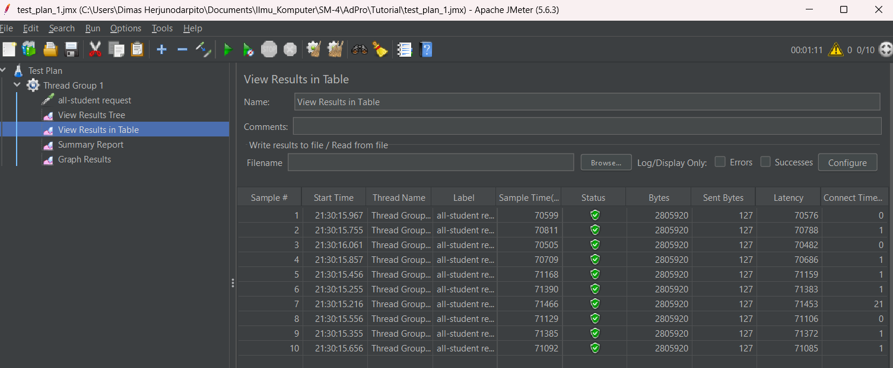
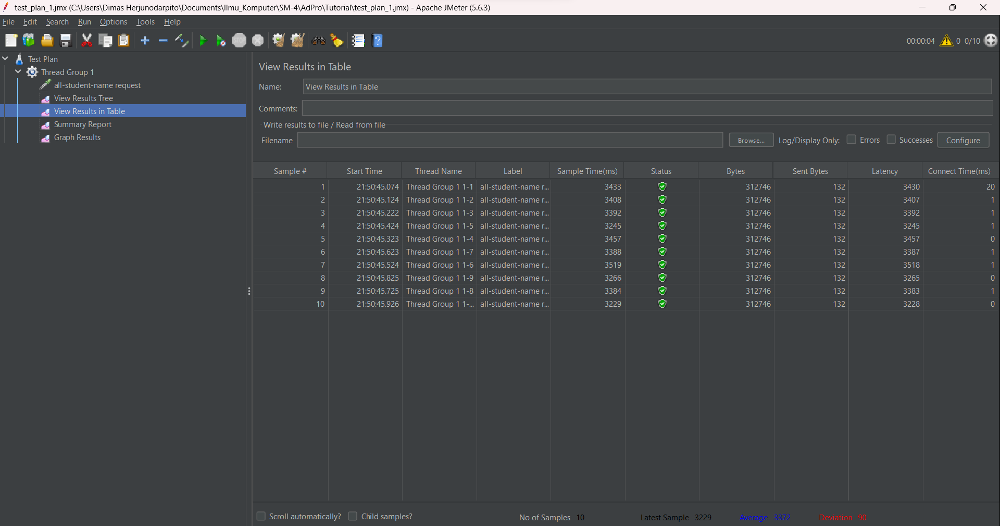
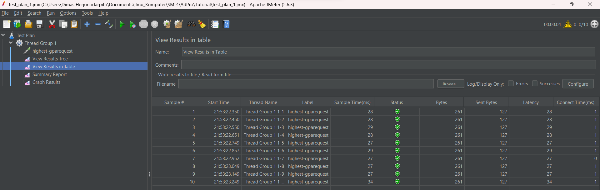
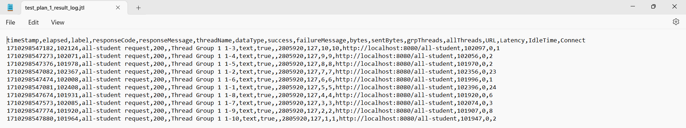
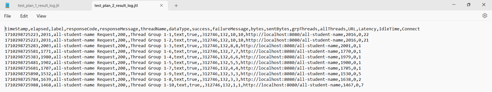
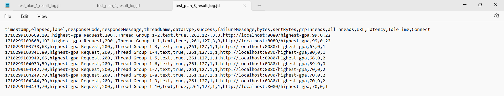
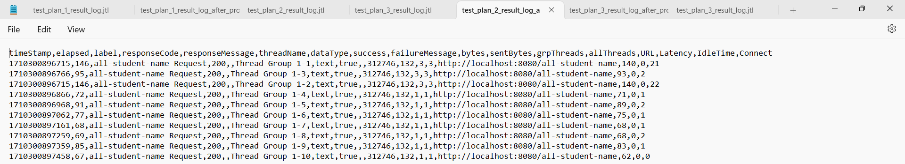
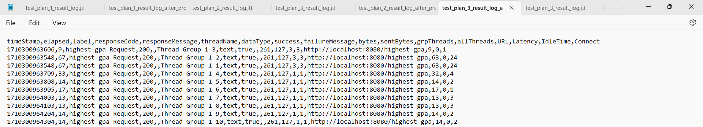

JMeter GUI results (Before refactor profiling):  
  
  
    
  
CLI JMeter Results (Before refactor profiling):  
  
  
  
  
CLI JMeter Results (After refactor profiling):  
  
  
  
  
It can be seen that the time difference before and after the refactor is much different. The execution speed after optimization is much faster. For example, in getAllStudentCourses (/all-student) which was originally 100000s to 20000 ms (500% faster), in /all-student-name which was originally 2000s to 140s (14 times or 1400% faster), and in /highest-gpa which was originally 100s to only a dozen (11 times or 1100% faster). So, optimization of a program will have a big effect on blackbox application testing using JMeter.  

# Reflection 5  
1. Performance testing and profiling are two different approaches used in the context of optimizing application performance. Here’s how they differ:  

    Performance Testing (e.g., with JMeter): Performance testing happens at the system level, under varying types of load. It ensures your system lives up to its Service Level Agreements (SLAs). This type of testing is typically used to understand how an application behaves under specific conditions, such as under heavy load or with many concurrent users.

    Profiling (e.g., with IntelliJ Profiler): Profiling, on the other hand, is what you do when your performance testing shows a problem. It helps you identify those parts of your system that contribute the most to the performance problem and shows you where to concentrate your efforts. IntelliJ IDEA provides integration with profilers like Java Flight Recorder and Async Profiler. These profilers collect valuable information about your Java code’s behavior at runtime, determine where the hot spots are, and help understand how a framework operates under the hood. IntelliJ Profiler uses sampling, so the overhead is very low – close to running the program without the profiler.  

    In summary, while performance testing gives you a system-level view of your application’s performance, profiling allows you to drill down into the code level to identify and address specific performance bottlenecks. Both are essential tools in the process of optimizing application performance. They complement each other and are often used together during the performance optimization process.  
  
2. Profiling helps me in knowing which part of the program is hampering the overall performance of the application. Thus, I only need to optimize those parts so that the overall application will improve its performance better without the need to fix too many parts of the application.  
  
3. Yes, as in the example exercise in the tutorial, with the Intellij profiler, I can find out that the part of the program that takes the longest time is the findStudentWithHighestGpa method. I can even find out which line in the method is hampering the performance of the method. Because I get the information on the duration of time needed to operate the function calls, I can more easily detect which part of the program is a bottler neck for the larger program.  

4. One of the most challenging things about performing performance testing and profiling is understanding the relevant output results and identifying which parts of the program are bottlenecks in the application. The way to overcome this is to examine the output of JMeter or the profiler carefully and slowly, and it may take some time to get used to this new technology in order to obtain important information more easily.  
  
5. As stated earlier, using IntelliJ's profiler allows me to identify the bottleneck parts of the program, know how long it takes to execute a method call, and how often the method is called. With this information, we can adjust the parts of the program that need optimization and ignore the unnecessary ones. It is important to remember that "premature optimization is the root of all evil", as unnecessary optimization efforts will only reduce the readability of our code.  

6. To date, I have not experienced the case discussed, but from the literature I have read, JMeter performance is affected by various factors such as operating system, JVM version, and others. These variations can result in differences in JMeter testing between one device and another. The way around this, as suggested in the link I found at https://stackoverflow.com/questions/68666822/jmeter-results-not-consistent-and-depend-from-the-running-machine, is to use containers like Docker instead of .jmx files, and also pay attention to think time. By doing so, it is expected that the JMeter test results will be more consistent and not fluctuate from one machine to another.  
  
    In addition, it is important to keep in mind that the test results from profiler and JMeter may differ due to different ways of working, where JMeter focuses on testing the application's persistence.  

7. The action I take to improve the performance of the code after the testing and profiling process is done is to check the duration taken by the program to respond to requests using JMeter. If the response is too slow, I then use the profiler to find the bottleneck part of the code and find ways to improve its performance. After making the changes, I made sure that the output remained the same as before to ensure the correctness of the code. For good measure, I also built unit tests as discussed in the previous tutorial, and ran them. If the unit test succeeds, the modified code should work fine. However, it is important to assess whether the unit tests created are actually effective and relevant.  